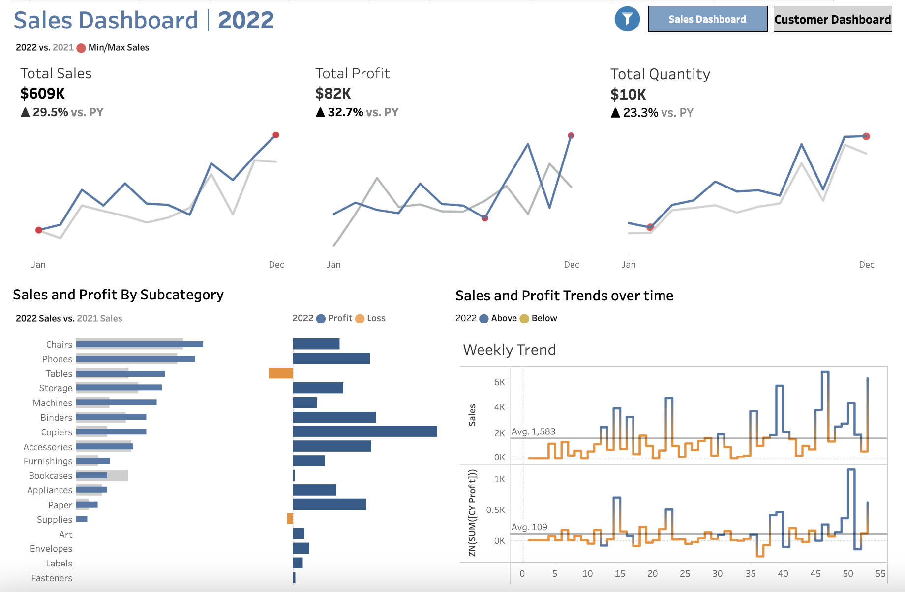
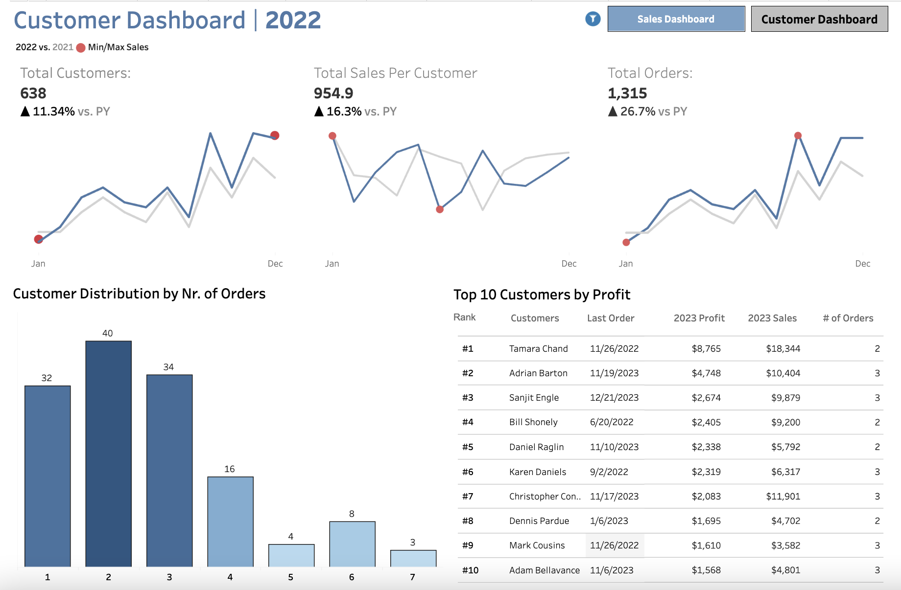

# Sales Trends & Customer Analytics Dashboard

🔗 [View the Live Interactive Dashboard on Tableau Public](https://public.tableau.com/app/profile/sahil.sharma1936/viz/SalesTrendsandCustomerAnalytics/CustomerDashboard)

## ✨ Interactive Features
This dashboard is **fully interactive** with navigation buttons that allow you to switch between:
- **Sales Dashboard** → Analyze revenue trends, product performance, and regional sales patterns.  
- **Customer Dashboard** → Explore customer demographics, segmentation, and retention metrics.  

The goal is to make it easy for business users to move between sales insights and customer analytics in a single, unified experience.

## 📊 Project Overview
This Tableau project analyzes **sales trends and customer behavior** to uncover actionable insights for business growth.  
The dashboard helps stakeholders:
- Track revenue and order trends over time
- Identify top-performing customer segments
- Visualize sales distribution across regions and categories
- Explore customer retention and engagement patterns

## ⚙️ Tools & Skills Used
- **Tableau Public** → Dashboard creation & interactive navigation  
- **SQL / Excel (optional)** → Data cleaning and preparation  
- **Data Visualization** → Storytelling with KPIs, filters, and drill-downs  

## 📸 Dashboard Previews
  
  

## 📈 Key Insights
- Seasonal peaks in sales highlight strong Q4 performance.  
- High-value customers account for ~25% of revenue, indicating potential for loyalty initiatives.  
- Customer churn risk identified in specific regions; recommendation: targeted retention campaigns.  

## 🚀 How to Use
1. Open the [Tableau Public link](https://public.tableau.com/app/profile/sahil.sharma1936/viz/SalesTrendsandCustomerAnalytics/CustomerDashboard).  
2. Use the **navigation buttons** to switch between **Sales** and **Customer** dashboards.  
3. Apply filters to explore results by product, region, or customer type.  
4. Hover over charts to view detailed KPIs and trends.  

## 👤 Author
**Sahil Sharma**  
- LinkedIn: [linkedin.com/in/sahil-r-sharma](https://www.linkedin.com/in/sahil-r-sharma)  
- GitHub: [github.com/sahilatwork](https://github.com/sahilatwork)  
